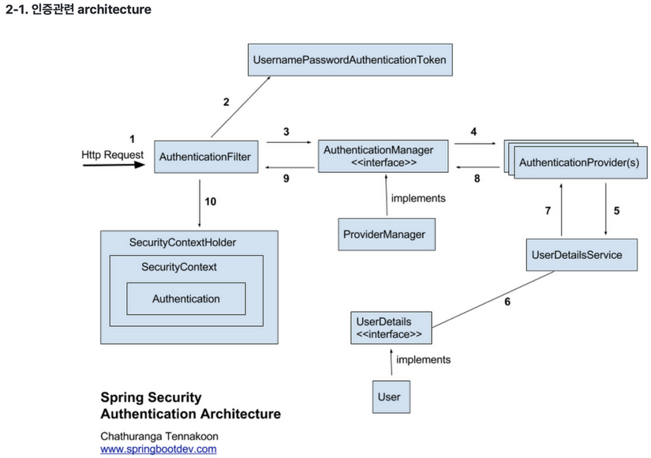

spring security
===============
### 기본
* 인증(Authentication): 해당 사용자가 본인이 맞는지를 확인하는 절차 
* 인가(Authorization): 인증된 사용자가 요청한 자원에 접근 가능한지를 결정하는 절차 
* Principal(접근 주체): 보호받는 Resource에 접근하는 대상
* Credential(비밀번호): Resource에 접근하는 대상의 비밀번호

DelegatingFilterProxy → FilterChainProxy → List 구조  


  

### [CSRF 공격](https://zzang9ha.tistory.com/341) 보호기능
* `@EnableWebSecurity` 어노테이션을 지정할 경우 자동으로 CSRF 보호 기능이 활성화된다.
  * 요청에 대한 CSRF 토큰을 따로 지정하거나 필터링 하지 않으면 403 error가 난다.
  * CSRF 토큰을 비교해 정상적인 HTTP method인지 구별한다.
  
### PasswordEncoder
```java
public interface PasswordEncoder {
  String encode(CharSequence rawPassword);
  boolean matches(CharSequence rawPassword, String encodedPassword);
}
```


### Spring security를 통한 사용자 정보 가져오기
@AuthenticationPrincipal을 이용한 커스텀 애노테이션 정의
```java
@Target({ ElementType.PARAMETER, ElementType.ANNOTATION_TYPE })
@Retention(RetentionPolicy.RUNTIME)
@AuthenticationPrincipal(expression = "#this == 'anonymousUser' ? null : account")
public @interface CurrentUser {
    // spring boot의 기능인 에노테이션 상속(순수 java는 안됨)을 이용해 애노테이션 길이를 줄였다.
    // 이 애노테이션을 참조하는 현재 객체가 anonymousUser면 null 아니면 account 설정
    // account라는 것은 UserAccount의 필드객체 명으로, 서로 이름이 같아야한다.
}
```

#### 컨트롤러에서 사용
```java
public String home(@CurrentUser Account account, Model model) {
    // 아래코드는 model.addAttribute(account)와 같지만, account=null 인 객체를 명시하기위해 이대로 씀
    model.addAttribute("account", (account != null) ? account : null);
    // null인 객체가 손님
    return "index";
}
```


### spring security를 통한 폼 로그인
* 설정추가: [SecurityConfig.java](studywithmewebapp/src/main/java/dev/valium/studywithmewebapp/config/SecurityConfig.java)
* DB 정보를 조회 할 [UserDetailsService](studywithmewebapp/src/main/java/dev/valium/studywithmewebapp/service/AccountService.java) 구현
  * spring security filter를 먼저 거치기에 controller 같은 handler를 만들 필요가 없다.
  * 단지 UserDetailsService를 확장하면된다.
  
  > SecurityConfig.java에는 logout도 설정이 돼있는데 logout은 이후 별다른 구현/설정이 필요가 없다.
  > 그 이유는 login 때 등록한 UserDetailsService bean을 사용하기 때문이다. 